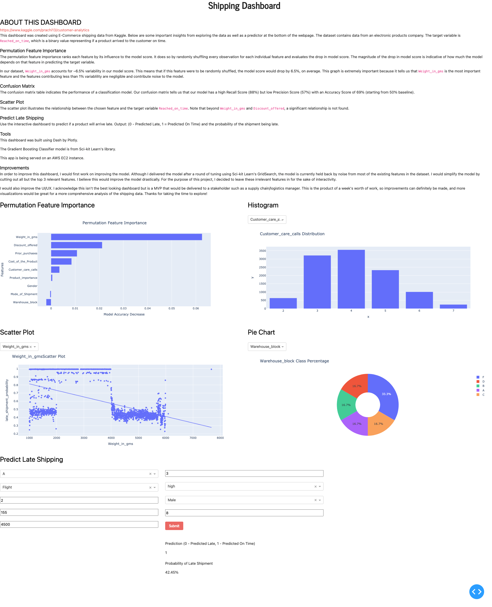

# What the app does
The app shows visualizations from E-Commerce shipping data from Kaggle
[here](https://www.kaggle.com/prachi13/customer-analytics). It's also
interactive in creating a scatter plot based on a user-chosen feature when
compared with the target variable `Reached_on_time`. 

### Feature Variables
The dataset contains 10,999 observations and 10 features. The 10 features are:

• Warehouse_block – The Company has a big Warehouse which is divided into blocks A, B, C, D, and E.

• Mode_of_Shipment – The Company ships the products in multiple ways such as Ship, Flight and Road.

• Customer_care_calls – The number of calls made from enquiry for enquiry of the shipment.

• Customer_rating – The company has rated from every customer. 1 is the lowest (Worst), 5 is the highest (Best).

• Cost_of_the_Product – Cost of the Product in US Dollars.

• Prior_purchases – The Number of Prior Purchases.

• Product_importance – The company has categorized the product in the various parameter such as low, medium, high.

• Gender – Customer's gender, either Male or Female.

• Discount_offered – Discount offered on that specific product.

• Weight_in_gms – It is the weight in grams.

### Target Variable
• Reached_on_time – It is the target variable, where 1 Indicates that the product has NOT reached on time and 0 indicates it has reached on time. Switched to 1 = Reached on time and 0 = Not reached on time.

