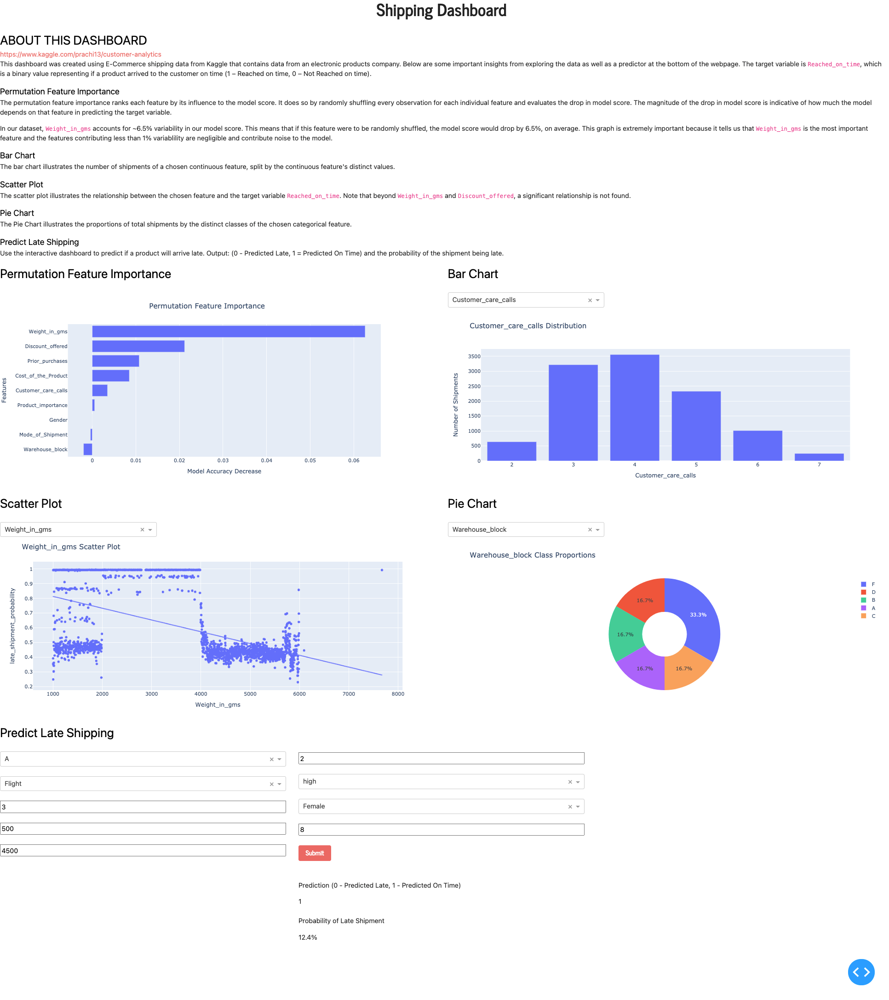

# What the app does
The app shows visualizations from E-Commerce shipping data from Kaggle
[here](https://www.kaggle.com/prachi13/customer-analytics). It's also
interactive in creating a scatter plot based on a user-chosen feature when
compared with the target variable `Reached_on_time`. 

## Feature Variables
The dataset contains 10,999 observations and 10 features. The 10 features are:

• `Warehouse_block` – The Company has a big Warehouse which is divided into blocks A, B, C, D, and E.

• `Mode_of_Shipment` – The Company ships the products in multiple ways such as Ship, Flight and Road.

• `Customer_care_calls` – The number of calls made from enquiry for enquiry of the shipment.

• `Customer_rating` – The company has rated from every customer. 1 is the lowest (Worst), 5 is the highest (Best).

• `Cost_of_the_Product` – Cost of the Product in US Dollars.

• `Prior_purchases` – The Number of Prior Purchases.

• `Product_importance` – The company has categorized the product in the various parameter such as low, medium, high.

• `Gender` – Customer's gender, either Male or Female.

• `Discount_offered` – Discount offered on that specific product (percentage).

• `Weight_in_gms` – The product weight in grams.

## Target Variable
• `Reached_on_time` – It is the target variable, where 1 Indicates that the product has NOT reached on time and 0 indicates it has reached on time. Switched to 1 = Reached on time and 0 = Not reached on time.

## Tools
This dashboard was built using Dash by Plotly. The predictor uses a Gradient Boosting Classifier model from Sci-kit Learn's library that I trained in /notebook/shipping.ipynb of this repository. This application is being served on AWS via Heroku.

## Findings
#### Permutation Feature Importance
The top 5 most influential features in increasing model score are:
 1. `Weight_in_grams` – 6.26%
 2. `Discount_offered` – 2.12%
 3. `Prior_purchases` – 1.08%
 4. `Cost_of_the_Product` – 0.85%
 5. `Customer_care_calls` – 0.35%

#### Bar Chart
`Weight_in_gms`

Number of products whose weight is below 2000 grams – `3241`

Number of products whose weight is between 2000 and 4000 grams – `1792`

Number of products whose weight is greater than 4000 grams – `5966`

`Discount_offered`

Number of products that have a discount less than or equal to 10% – 8352

Number of products that have a discount greater than 10% – 2647

`Prior Purchases` – Among all orders, customers with 3 prior purchases is the most occuring (3955 orders). Distribution is positively skewed with a range between 2 and 10 prior purchases.
`Customer_care_calls` – Among all orders, 4 customer care calls is most common. Distribution is Normally distributed.
`Cost_of_the_Product` – Product costs range from $96 to $310. Looks like a blend of normal and uniform distribution.

#### Scatter Plot
1. `Weight_in_gms` – As you can see from the graph, products with weights between 2000 and 4000 grams (4.4 to 8.8 lbs) have a much higher probability of arriving late. With additional EDA, I was able to validate the accuracy of these probabilities by verifying that 99.8% of products between 2000 and 4000 grams arrive late in this dataset. I juxtaposed this with products whose weights are less than 2000 grams and products whose weights are greater than 4000 grams, and found that 67.8% and 43.2% of those products are arriving late, respectively. 
2. `Discount_offered` – From the graph, one can see that products whose discount is above 10% see a 100% late shipment probability. This was verified with additional EDA where products with less than or equal to 10% discount and products with greater than 10% discount see a 46.9% and 100% late shipment rate, respectively.
3. `Prior_purchases`, `Customer_care_calls`, and `Cost_of_the_Product` do not seem to have any significant effect on late shipment probabilities.

#### Pie Chart
`Warehouse_block` – 33.3% of products come from Warehouse_block F. Every other Warehouse_block (A, B, C, D) each have 16.7% of all products in the data.
`Mode_of_Shipment` – Ship is the most common Mode_of_Shipment (67.8%). Flight and Road account for 16.2% and 16% of the rest of the products.
`Product_importance` – Products have a Product_importance of either 'low', 'medium', or 'high', which account for 48.2%, 43.2%, and 8.62% of all products, respectively.
`Gender` – Customers are either male (49.6%) or female (50.4%).
`Reached_on_time` – Of all orders in the dataset, 59.7% of orders arrived late and 40.3% arrive on time.

### Improvements
In order to improve this dashboard, I would first work on improving the model. Although I delivered the model after a round of tuning using Sci-kit Learn's GridSearch, the model is currently held back by noise from a few of the existing features in the dataset. Removing these features would improve the model. For the purpose of this project, I decided to leave most of the features in training the model for the sake of interactivity. 

I would also improve the UI/UX. I acknowledge this isn't the best looking dashboard but is an MVP that would be delivered to a stakeholder such as a supply chain/logistics manager. This is the product of a week's worth of work, so improvements can definitely be made, and more visualizations would be great for a more comprehensive analysis of the shipping data. Thanks for taking the time to explore!"""),
